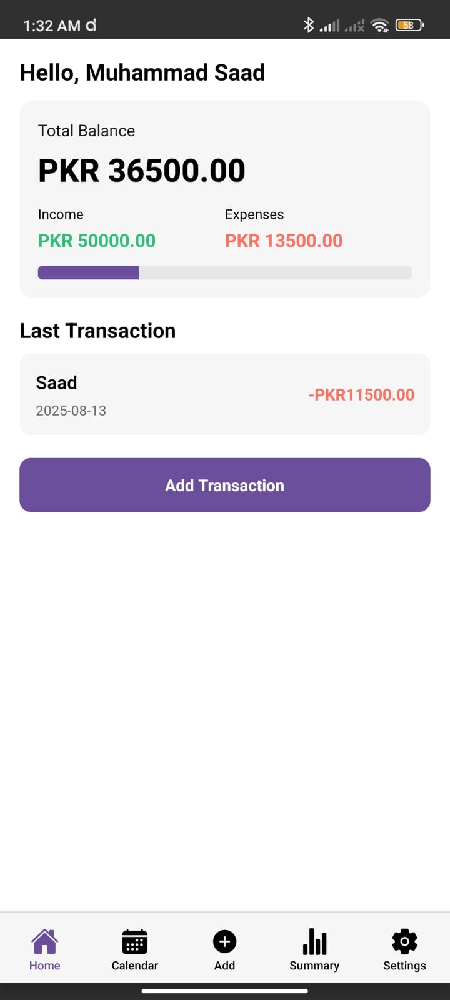

# Expense Tracker App

A modern and intuitive **React Native (Expo)** application for tracking your daily income and expenses.  
Supports dark & light mode, a calendar view, and accurate date handling for the Pakistan time zone.  
Built with **EAS Build** for easy deployment to Android.

---

## Features

- Calendar view to view transactions by date
- Dark & light mode support
- Accurate time zone tracking (Asia/Karachi)
- Add, edit, and delete transactions
- Transaction summary view
- Multi-currency support
- User-friendly and responsive design

---

## Screenshots

| Home Screen | Calendar Screen | Add Transaction |
|-------------|-----------------|-----------------|
|  |  |  |

| Summary Screen | Settings Screen | Alternate Home View |
|----------------|-----------------|---------------------|
|  |  |  |

---

## Installation

````markdown

1. Clone the repository:
   ```bash
   git clone https://github.com/YOUR-USERNAME/ExpenseTracker.git
   ```

2. Navigate into the project:

   ```bash
   cd ExpenseTracker
   ```

3. Install dependencies:

   ```bash
   npm install
   ```

4. Start the Expo development server:

   ```bash
   npx expo start
   ```

---

## Building for Android (EAS)

To build the app for Android using EAS Build:

```bash
eas build -p android --profile preview
```

---

## Tech Stack

* React Native (Expo)
* react-native-calendars
* Context API for state management
* EAS Build for app distribution

---

## License

This project is licensed under the MIT License.

---

## Author

**Muhammad Saad**

GitHub: [https://github.com/saadmdev](https://github.com/saadmdev)

